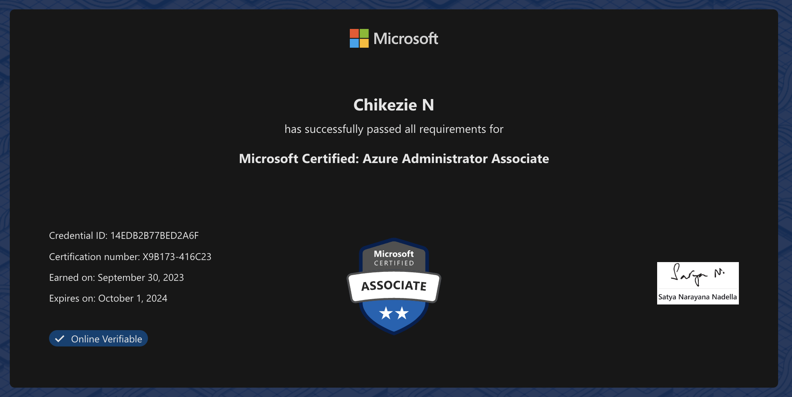

*Microsoft certifications are known for being among the most difficult.*

I recently passed the Microsoft Certified AZ-104 Azure Administrator Associate exam.

It is a challenging exam --academic study is not enough. It really that requires a good understanding of Azure fundamentals, services, and management tools, that can only come from years of industry experience.

## Some of the tougher subjects include:

- **Azure Networking**
  - Virtual Networks
  - Subnets
  - Load Balancing

- **Azure Compute**
  - Virtual Machines
  - Scale Sets

- **Azure Monitoring, Backup, and Troubleshooting**

- **Azure Security**
  - Role-Based Access Control (RBAC)
  - Azure Security Center

The exam is difficult because it covers a wide range of topics and requires a deep understanding of Azure. The exam is also challenging because it requires hands-on experience with Azure. You cannot pass the exam simply by bingeing pluralsight.

## Hard but fair

Ultimately I found the AZ-104 exam to be a challenging but rewarding experience. The exam forced me to delve into areas of Azure that I wouldn't normally have explored, such as advanced networking, routing and DNS.

