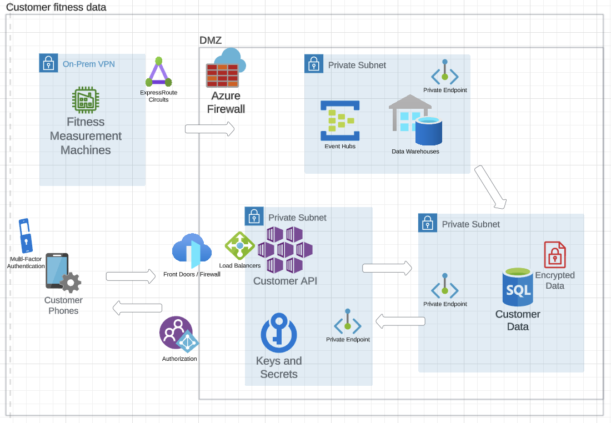

## Project Overview
Recently, I was given a solution to architect for a client who had on-premise systems and wanted to move to the cloud to increase scalability and reduce costs. The client's current architecture involved devices sending fitness data to an API hosted on a virtual machine (VM), which also served as the backend for a mobile app. However, this system was tightly coupled and needed to be broken up into microservices.

## The Challenge
To begin the process, I first identified the different components of the system and their dependencies. Then designed a new architecture that separated these components into individual microservices, each with its own API. This allowed scaling each microservice independently.

I also implemented containerization using Docker, packaging each microservice into a lightweight, portable container, reducing the client's infrastructure costs.

## Safety first
In addition, I designed the new system to be PCI DSS and ISO 27001 compliant, ensuring that the client's data was secure and protected. This involved implementing strict security measures, such as encryption, access controls, and regular security audits.
